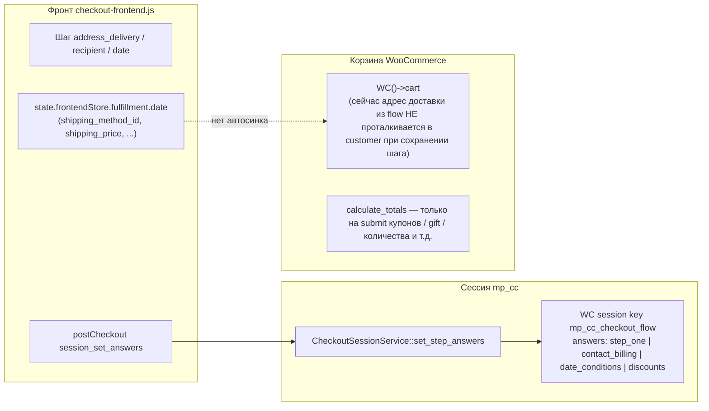

# §28.2 Аудит потока данных доставки (read-only)

**Задача:** `dp.md` §28.2 — проследить цепочку «адрес → сессия модуля → корзина WC → UI», зафиксировать `shipping_price`, `sub_action`, валидацию, купоны/налоги, риск `suppress_shipping_in_summary`.  
**Ограничение:** правки только в документации; **`dp.md` не изменялся.**  
**Дата фиксации:** по состоянию кода репозитория `mp-custom-checkout` на момент аудита.

Связанные документы: [shipping-wc-integration.md](./shipping-wc-integration.md) (§28.1), эпик §28 в `dp.md` (справочно, без редактирования).

---

## 1. Диаграмма (логическая)

**Вывод по фактам кода:** между сохранением ответов шага (`session_set_answers`) и **обновлением адреса в `WC()->customer` / пересчётом пакетов доставки** **нет** связи: flow живёт в `CheckoutSessionService`, корзина WC не получает город из `contact_billing` на каждом шаге.

---

## 2. Хранение ответов шагов → ключи в `flow['answers']`

| Шаг (`step_id` в AJAX) | Ключ хранения (`normalize_answers_storage_key`) | Содержимое, релевантное доставке |
|------------------------|--------------------------------------------------|-----------------------------------|
| `address_delivery` | `step_one` | Адрес/доставка шага 1 (конфиг реестра). |
| `recipient`, `payment`, `confirm`, … | `contact_billing` | Контакты, адрес, платёж. |
| `date`, `conditions` | `date_conditions` | `shipping_method_id`, `shipping_method_title`, `shipping_price`, `selected_date`, тарифы и т.п. |
| `discounts` / купоны | `discounts` | Синхронизируется с корзиной через `sync_discounts_from_cart()`. |

Источник: `CheckoutSessionService::normalize_answers_storage_key()` — файл  
`core/Checkout/Routing/CheckoutSessionService.php` (около строк 411–431).

---

## 3. Где выставляется и где читается `shipping_price`

| Направление | Файл / место | Поведение |
|-------------|--------------|-----------|
| **Запись (фронт)** | `assets/js/checkout-frontend.js` | При выборе метода из каталога: `dateBox.shipping_price = Number(selection.price \|\| 0)` (около 2021); далее в сводке `summary.shipping_total` (около 2051). |
| **Чтение (бэк, summary для UI)** | `core/Routing/CheckoutRouteContext.php` | Если в `answers['date_conditions']['shipping_price']` число — подменяется `$shipping_total` для `summary` (строки ~189–191); также корректируется `$total_edit` при подмене (строки ~231–232). |
| **WC cart** | — | Значение `shipping_price` из flow **не** записывается в `WC()->cart` как выбранный тариф; корзина живёт своей жизнью до явного `calculate_totals` в других обработчиках. |

---

## 4. Таблица «событие (AJAX / хук) → обновляется ли корзина WC»

| Событие | Файл / функция | `WC()->cart` пересчёт / адрес customer | Примечание |
|---------|----------------|----------------------------------------|--------------|
| `session_set_answers` | `CheckoutAjaxHooks::handle` → `set_step_answers` | **Нет** | Только `CheckoutSessionService::set_step_answers` + ответ с `get_cart_data()`. |
| `session_set_step` | `CheckoutAjaxHooks` | **Нет** | |
| `session_set_scenario` | `CheckoutSessionService::set_scenario` | **Нет** | Меняется сценарий и snapshot flow. |
| `session_get_state` | `CheckoutAjaxHooks` + `sync_discounts_from_cart` | **Косвенно** | `sync_discounts_from_cart` обновляет только `answers.discounts` из купонов/PW, не адрес и не доставку. |
| `update_quantity` | `handle_update_quantity` | **Да** | `$cart->set_quantity` → `sync_discounts_from_cart` → `get_cart_data()`. |
| `remove_item` | `handle_remove_item` | **Да** | Удаление позиции, пересчёт корзины WC. |
| `apply_coupon` / `remove_coupon` | handlers | **Да** | `calculate_totals()` после операции. |
| `apply_gift_card` / `remove_gift_card` | handlers + `GiftCardIntegration` | **Да** | `calculate_totals()` в интеграции/обработчике. |
| `submit_payment` | `create_order_from_cart_and_answers` | **Да (на заказе)** | Создаётся `WC_Order`, товары из корзины, контакт через `OrderMetaHooks::apply_contact_fields_to_order`, затем `$order->calculate_totals( true )`. Адрес на **заказе**, не обязательно предварительный пересчёт доставки в **сессии** корзины по городу checkout. |
| `woocommerce_checkout_order_created` | `OrderMetaHooks::apply_contact_fields_to_order` | N/A (order) | Billing/shipping поля заказа из `contact_billing`; не `WC()->customer` в runtime шагов. |

**Итог для режима `woocommerce` (цель §28):** минимум нужно вешать пересчёт на **`session_set_answers`** для шагов, где меняется адрес или выбранный метод доставки (и при необходимости на `session_set_scenario`), плюс дебаунс на фронте — см. §28.3 в эпике.

---

## 5. Список `sub_action` (разрешённые в `CheckoutAjaxHooks::is_session_sub_action`)

Из массива в `CheckoutAjaxHooks.php` (~строка 246):

`session_set_step`, `session_set_answers`, `session_set_scenario`, `session_get_state`, `session_abandon`, `update_quantity`, `remove_item`, `validation_log`, `apply_coupon`, `remove_coupon`, `apply_gift_card`, `remove_gift_card`, `set_payment_gateway`, `gateway_render_diagnostics`, `submit_payment`, `client_error_log`, `ajax_error_log`.

**Кандидаты на триггер пересчёта WC при `pricing_mode=woocommerce`:**  
`session_set_answers` (контакт/адрес/дата-доставка), опционально `session_set_scenario`, возможно отдельный новый `sub_action` если не хочется дублировать логику на каждый `step_id`.

---

## 6. Валидация `validate_shipping_answers_payload` vs корзина WC

| Аспект | Факт |
|--------|------|
| Условие вызова | Только если включён флаг `FeatureFlagResolver::is_enabled( FLAG_CHECKOUT_UI_V2, false )` (`CheckoutAjaxHooks.php` ~685). |
| Источник истины | `shipping_catalog()` из `SafeSettingsResolver::get_section('delivery')` — не `WC()->cart->get_shipping_packages()`. |
| Поля | `shipping_method_id` обязателен; при наличии тарифов в каталоге — `shipping_tariff_id` должен входить в список тарифов метода. |
| Расхождение с WC | ID вида `official_cdek:482` из нативного checkout **не** проходят проверку по ключам каталога (`post_russia`, `courier`, …), пока каталог не расширен или режим не переключён. |

---

## 7. Купоны, подарочные карты, налоги

| Цепочка | Поведение |
|---------|-----------|
| Купоны | `apply_coupon` / `remove_coupon` вызывают `$cart->calculate_totals()` после операции — стандартный порядок WC. |
| PW Gift Cards | `GiftCardIntegration` вызывает `WC()->cart->calculate_totals()` после apply/remove. |
| `sync_discounts_from_cart` | Обновляет `flow.answers.discounts` из корзины; **не** трогает доставку. |
| Налоги | В `get_cart_data()` итог налога и total корректируются при `suppress_shipping_in_summary` и при подмене `shipping_price` — см. следующий раздел. |

Комментарий в коде про PW: `CheckoutRouteContext.php` ~246 (`woocommerce_after_calculate_totals`).

---

## 8. Риск `suppress_shipping_in_summary` vs «честная» доставка WC

**Где:** `CheckoutRouteContext::get_cart_data()` (~196–211, ~226–230).

**Условия:**

1. Сценарий `pickup` и корзине нужна доставка → доставка в summary обнуляется, `shipping_deferred = true`.  
2. Либо текущий шаг `address_delivery` или `recipient` (константы `ScenarioStepRegistry`) при `needs_shipping()` → то же.

**Конфликт с `woocommerce`:** даже после пересчёта СДЭК в корзине пользователь на ранних шагах **не увидит** сумму доставки в sidebar, пока действует suppression — при этом внутри корзины WC сумма может уже быть ненулевой.

**Направления решения (для §28.5, не реализация здесь):**

- Условно отключать suppression при `pricing_mode=woocommerce`, **или**
- Показывать отдельную строку «доставка по адресу (оценка)» из пакетов, не смешивая с `shipping_deferred`, **или**
- Оставить отложенное отображение до шага оплаты/подтверждения осознанно (продуктовое решение).

---

## 9. Создание заказа при `submit_payment` и доставка

В `create_order_from_cart_and_answers` (`CheckoutAjaxHooks.php` ~568–609):

- В заказ добавляются **товары** из корзины.
- Выставляется способ оплаты и **billing** (и shipping адрес на заказ через `OrderMetaHooks::apply_contact_fields_to_order`).
- Вызывается `$order->calculate_totals( true )`.

**Наблюдение по grep по репозиторию:** явных вызовов `WC_Order::add_shipping` / добавления shipping line из корзины в плагине **не найдено** (поиск `add_shipping`, `shipping_item`). Итоговая стоимость доставки на созданном заказе зависит от поведения `WC_Order::calculate_totals()` при уже выставленных адресах — **требуется проверка на стенде** (не выводить здесь предположения без прогона).

---

## 10. Peer-review / self-review чеклист

- [ ] Подтверждён список всех путей, где фронт вызывает `session_set_answers` для полей, влияющих на адрес (`checkout-frontend.js` grep `session_set_answers`).
- [ ] Проверено на стенде: после `submit_payment` в заказе есть ожидаемая строка доставки и сумма СДЭК (если должны быть).
- [ ] Согласовано с §28.1: при `woocommerce` не используем `shipping_price` для подмены итога.
- [ ] Зафиксировано продуктовое решение по `suppress_shipping_in_summary`.

---

---

## 11. Дополнение: §28.3 — синк с `WC()->customer` при `delivery.pricing_mode=woocommerce`

**Когда:** после успешного `CheckoutSessionService::set_step_answers` (шаги `address_delivery`, `recipient`, `payment`, `confirm`, `date`, `conditions`, `scenario`) и после `set_scenario` в `session_set_scenario`.

**Код:** `integrations/WooCommerce/WcCustomerShippingSync.php` вызывается из `CheckoutAjaxHooks` сразу после сохранения flow. Контакт для полей billing/shipping: `array_merge( answers.step_one, answers.contact_billing )` (как на заказе по смыслу сценария `hide_address_fields` — через `OrderMetaHooks::apply_contact_location_to_customer()` и общий приватный маппинг с `apply_contact_fields_to_order`).

**Пересчёт:** один вызов `WC()->cart->calculate_totals()` на AJAX-запрос (после `$customer->save()`).

**Логи (без PII):** если в сессии WC для пакета выбран `chosen_shipping_methods[i]`, которого нет среди ключей `rates` пакета после пересчёта — `mp_custom_checkout_log` с префиксом `[wc_customer_shipping_sync] chosen_method_not_in_rates` и полями `package_index`, `chosen_method_id`, `rate_id_count`, `rate_id_sample`.

**Флаг режима:** при `pricing_mode !== 'woocommerce'` синк и пересчёт по этому пути **не** выполняются.

**UI (checkout v2):** на экране `delivery_screen` после блока выбора доставки рендерится тот же `buildAddressBlockHtml`, что и на шаге получателя (поля дублируются для раннего ввода). При `session_set_answers` с `step_id=address_delivery` дополнительно уходит частичный `session_set_answers` с `step_id=recipient` только с полями `country|state|city|address_1|address_2|postcode`; в `CheckoutSessionService::set_step_answers` для `contact_billing` применяется `array_replace` с уже сохранённым контактом, чтобы не затирать ФИО/email.

---

*Конец отчёта §28.2; п. 11 — актуализация после §28.3.*
